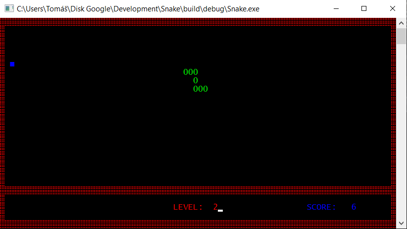

# Snake
A simple console GUI game written in C using a few Windows' functions.

Since it relies on some Windows' functions you need Windows operating system to build it.

To control the game use arrow keys.

License: CC BY 4.0
